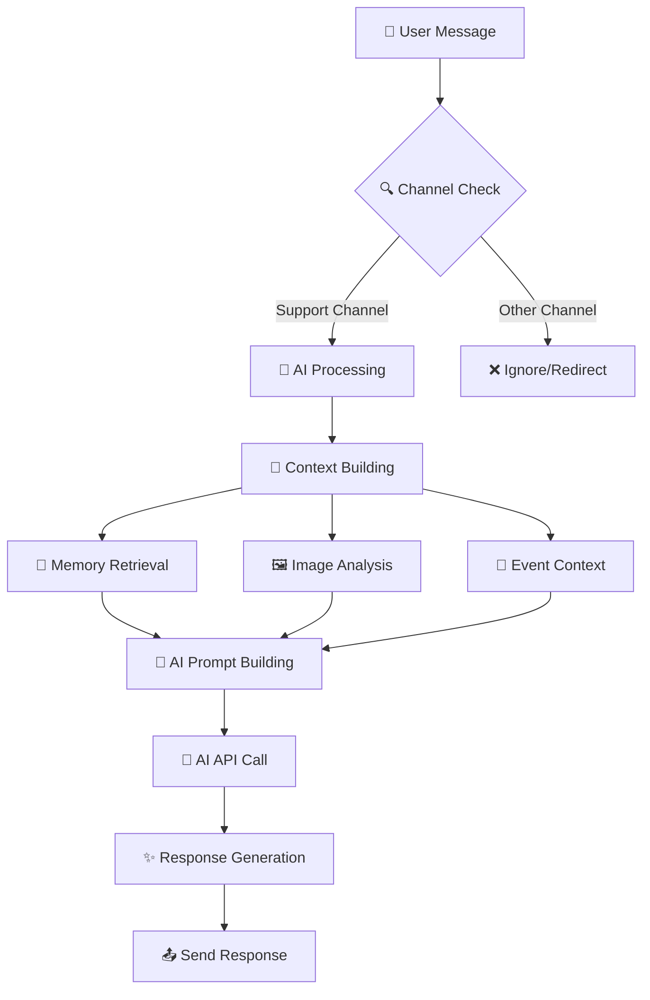

<div align="center">

# 🤖 Shotdevs Discord Bot

[](https://discord.js.org/)
[](https://nodejs.org/)
[](https://ai.google.dev/)
[]()

> **A modern, AI-powered Discord bot for Shotdevs custom Discord bot and web development services with intelligent responses and organized architecture**

[🚀 Features](#-features) • [📁 Project Structure](#-project-structure) • [⚙️ Setup](#️-setup) • [📋 Commands](#-commands) • [🔧 Customization](#-customization)

---

</div>

## ✨ Features

<table>
<tr>
<td width="50%">

### 🧠 **AI-Powered Intelligence**
- **Smart Responses**: Every message processed through advanced AI
- **Context Awareness**: Remembers conversation history
- **Image Analysis**: AI-powered image understanding
- **Natural Language**: Understands complex queries
- **Technical Guidance**: Expert advice on Discord bots and web development

</td>
<td width="50%">

### 🎯 **Modern Architecture**
- **Centralized Config**: Single configuration file
- **Modular Design**: Clean, organized code structure
- **Slash Commands**: Modern Discord command system
- **Event Management**: Create and manage server events
- **Rich Embeds**: Beautiful, informative responses

</td>
</tr>
<tr>
<td width="50%">

### 🛡️ **Advanced Features**
- **Memory System**: Context-aware conversations
- **Auto Cleanup**: Automatic event management
- **Error Handling**: Robust error management
- **Feature Flags**: Easy feature toggling
- **Quote System**: Automated project quote requests

</td>
<td width="50%">

### 🎨 **User Experience**
- **Friendly Responses**: Positive, helpful interactions
- **Quick Commands**: Fast access to information
- **Rich Formatting**: Beautiful message formatting
- **Emoji Integration**: Engaging visual elements
- **Service Focused**: Specialized for Discord bot and web development

</td>
</tr>
</table>

---

## 🏗️ Project Structure

```
📦 shotdevs-discord-bot/
├── 🤖 bot.js                          # Main bot entry point
├── 📄 package.json                    # Dependencies and scripts
├── 🔐 .env                           # Environment variables
├── 📁 src/
│   ├── ⚙️ config/
│   │   └── 📋 config.js              # 🎯 Centralized configuration
│   ├── 🎮 handlers/
│   │   ├── 🧠 aiHandler.js           # AI message processing
│   │   └── 💬 messageHandler.js      # Message routing
│   ├── ⌨️ commands/
│   │   └── 🎯 slashCommands.js       # Slash command handlers
│   ├── 📅 events/
│   │   └── 🚀 ready.js               # Bot ready event handler
│   ├── 🛠️ utils/
│   │   ├── 💭 messageHandler.js      # Message utilities
│   │   └── 🖼️ imageAnalyzer.js       # Image analysis
│   └── 📊 data/
│       └── 📅 events.js              # Event data management
└── 📁 data/
    └── 📄 events.json                # Event storage
```

---

## ⚙️ Configuration

All configuration is centralized in `src/config/config.js`:

<details>
<summary>🔧 <strong>Configuration Sections</strong></summary>

- **🤖 Bot Settings**: Name, version, activity status
- **💬 Discord Config**: Intents, channels, admin roles  
- **🏢 Company Info**: Pricing, support channels, FAQ
- **🧠 AI Settings**: API configuration, personality
- **💭 Response Templates**: Predefined responses
- **📋 Server Rules**: Discord server guidelines
- **🎛️ Feature Flags**: Enable/disable features

</details>

---

## 🚀 Quick Start

### 1️⃣ **Installation**

```bash
# Clone the repository
git clone https://github.com/shotdevs/shotdevs-ai-bot.git
cd shotdevs-ai-bot

# Install dependencies
npm install
```

### 2️⃣ **Environment Setup**

Create a `.env` file in the root directory:

```env
# Discord Bot Configuration
DISCORD_TOKEN=your_discord_bot_token_here
SUPPORT_CHANNEL_ID=your_support_channel_id_here

# AI Configuration  
api_key=your_ai_api_key_here
```

### 3️⃣ **Run the Bot**

```bash
# Start the bot
npm start

# Or run directly
node bot.js
```

---

## 📋 Available Commands

### 🎯 Slash Commands

| Command | Description | Permission |
|---------|-------------|------------|
| `/events` | 📅 List current events | Everyone |
| `/event <id>` | 🔍 Get event details | Everyone |
| `/add-event` | ➕ Add new event | Admin Only |
| `/remove-event <id>` | 🗑️ Remove event | Admin Only |
| `/auto-delete-events` | 🧹 Clean expired events | Admin Only |
| `/ping` | 🏓 Check bot latency | Everyone |
| `/services` | 🚀 View our services | Everyone |
| `/pricing` | 💰 View pricing information | Everyone |
| `/quote` | 📋 Request a project quote | Everyone |

### ⌨️ Prefix Commands

| Command | Description | Example |
|---------|-------------|---------|
| `-help` | 📖 Show available commands | `-help` |
| `-status` | 📊 Get server status | `-status` |
| `-plans` | 💰 View hosting plans | `-plans` |
| `-ticket` | 🎫 Create support ticket | `-ticket` |
| `-ping` | 🏓 Check bot latency | `-ping` |
| `-rules` | 📋 Show server rules | `-rules` |
| `-channels` | 📢 List important channels | `-channels` |
| `-ai <message>` | 🤖 Direct AI interaction | `-ai help me with hosting` |
| `-services` | 🚀 View our services | `-services` |
| `-pricing` | 💰 View pricing | `-pricing` |
| `-bot` | 🤖 Discord bot information | `-bot` |
| `-web` | 🌐 Web development info | `-web` |

---

## 🧠 AI Integration Flow



---

## 🔧 Customization

### 🎨 **Adding New Features**

1. **Add Configuration**:
   ```javascript
   // In src/config/config.js
   CONFIG.newFeature = {
       enabled: true,
       settings: { /* your settings */ }
   };
   ```

2. **Create Handler**:
   ```javascript
   // In src/handlers/newFeatureHandler.js
   class NewFeatureHandler {
       // Your implementation
   }
   ```

3. **Register in Bot**:
   ```javascript
   // In bot.js
   const newFeatureHandler = new NewFeatureHandler();
   ```

### 🎛️ **Modifying AI Behavior**

Edit `src/config/config.js`:

```javascript
ai: {
    personality: {
        tone: "Friendly and approachable",
        style: "Conversational and helpful",
        traits: [
            "Always positive and encouraging",
            "Patient and understanding",
            "Expert in Discord bot and web development"
        ]
    }
}
```

---

## 🛠️ Development

### 📦 **Dependencies**

```json
{
  "discord.js": "^14.14.1",    // Discord API wrapper
  "dotenv": "^16.4.5",         // Environment variables
  "node-fetch": "^2.7.0",      // HTTP requests
  "ora": "^8.2.0"              // Loading spinners
}
```

### 🔧 **Scripts**

```bash
npm start          # Start the bot
npm test           # Run tests (if available)
npm run lint       # Lint code (if configured)
```

---

## 📊 Performance

| Feature | Status | Performance |
|---------|--------|-------------|
| 🧠 AI Processing | ✅ Active | ~2-3s response time |
| 💾 Memory System | ✅ Active | 3 messages per user |
| 🖼️ Image Analysis | ✅ Active | ~5-10s processing |
| 📅 Event Management | ✅ Active | Instant |
| 🎯 Slash Commands | ✅ Active | Instant |

---

## 🤝 Contributing

We welcome contributions! Here's how you can help:

1. **🐛 Report Bugs**: Open an issue with detailed information
2. **💡 Suggest Features**: Share your ideas for improvements
3. **🔧 Submit PRs**: Contribute code improvements
4. **📖 Improve Docs**: Help make documentation better

---

## 📄 License

This project is **proprietary** to Shotdevs. All rights reserved.

---

## 🆘 Support

Need help? Here are your options:

- **💬 Discord**: [Join our server](https://discord.gg/shotdevs)
- **📧 Email**: hello@shotdevs.com
- **🌐 Website**: [shotdevs.com](https://shotdevs.com)
- **📊 Status**: [status.shotdevs.com](https://status.shotdevs.com)

---

## 🚀 About Shotdevs

**Shotdevs** is a custom Discord bot and website development service for your community. We provide:

### 🤖 **Custom Discord Bots**
- Tailor-made bots to automate tasks, engage users, and enhance your server
- Basic to premium solutions with custom features
- Ongoing support and maintenance

### 🌐 **Web Development**
- Modern, responsive websites and dashboards
- Static to full-stack applications
- Database integration and custom APIs

### 💡 **Why Choose Us?**
- **Expertise & Quality**: High-quality, professional solutions
- **Collaborative Process**: We work closely with you
- **Reliable & Secure**: Robust, dependable solutions
- **Affordable Pricing**: Top-tier services without breaking the bank

### 💰 **Our Pricing**

#### Discord Bot Development
- **Basic Bot**: ₹40 - Basic commands, welcome messages, moderation tools
- **Advanced Bot**: ₹80 - Custom commands, API integrations, logging & analytics
- **Premium Bot**: ₹150 - All advanced features, custom dashboard, priority support

#### Website Development
- **Static Website**: ₹50 - Up to 5 pages, responsive design, contact form
- **Dynamic Website**: ₹150 - All static features, database integration, admin panel
- **Full Stack Application**: ₹450 - All dynamic features, user authentication, custom API

#### Custom Projects
- **Request a Quote**: Custom solutions for unique requirements
- Complex Discord bots, full-featured web applications, custom integrations

---

<div align="center">

### 🌟 **Made with ❤️ by Shotdevs Team**

*Empowering communities with custom Discord bots and web development*

[](https://discord.gg/shotdevs)
[](https://shotdevs.com)

</div>